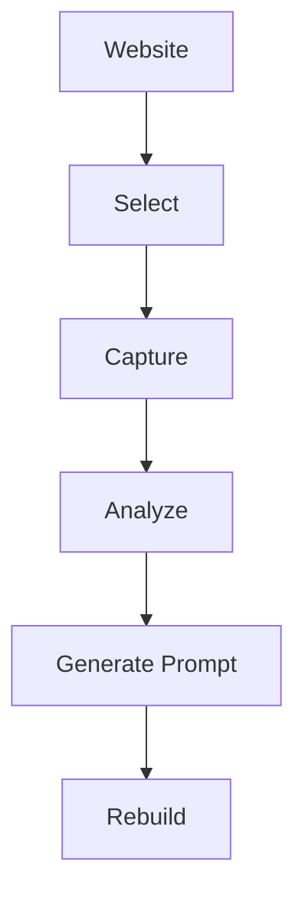
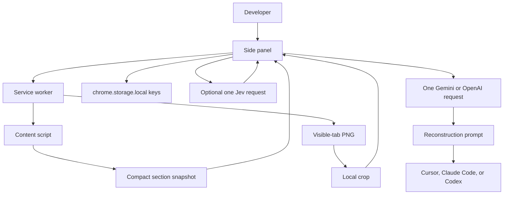
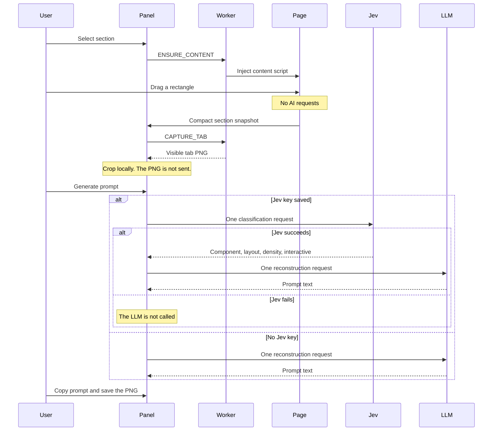

# Pixel2Prompt

### See It. Capture It. Rebuild It.

Turn any website section into an AI-ready reconstruction prompt.

Demo GIF: not recorded yet. Record it from a public page with [docs/DEMO.md](docs/DEMO.md).

[Chrome Web Store](docs/CHROME_STORE.md) · [GitHub](https://github.com/RadhikaSoni7/Pixel2Prompt)

The store listing is not live. The Chrome Web Store link is the submission guide. Do not treat this repository as a published listing.

---

## ✨ What is Pixel2Prompt?

Pixel2Prompt is a lightweight Chrome extension that lets developers capture any website section and convert its visual and structural characteristics into an AI-ready reconstruction prompt.

There is no account and no Pixel2Prompt server. You bring your own keys. Hover and selection stay on the device. Generate prompt sends one compact snapshot: at most one Jev request and one LLM request.

## 🚀 How It Works



Select and capture stay in the browser. Analyze is optional Jev classification. Generate Prompt is one call to Gemini or OpenAI. Rebuild happens in Cursor, Claude Code, or Codex, with the prompt and the reference PNG.

## ✨ Features

- Visual section selection
- Reference screenshot
- DOM and CSS analysis, as a compact snapshot
- Jev-powered analysis when you save a Jev key
- Bring your own keys
- AI reconstruction prompts
- Cursor, Claude Code, and Codex workflow
- Lightweight architecture: Manifest V3, no backend

## 🏗️ Architecture



Source file: [diagrams/architecture.mmd](diagrams/architecture.mmd). Detail: [docs/ARCHITECTURE.md](docs/ARCHITECTURE.md).

## Sequence



Source file: [diagrams/sequence.mmd](diagrams/sequence.mmd). User flow: [diagrams/user-flow.mmd](diagrams/user-flow.mmd).

## 🛠️ Tech Stack

- Chrome Manifest V3, minimum Chrome 116
- React 19 and TypeScript
- Vite and CRXJS
- Optional TypeSafe Jev (`jev-latest`)
- Gemini (`gemini-2.5-flash`) or OpenAI (`gpt-4o-mini`)
- Keys in `chrome.storage.local`

## 🚀 Installation

Requirements: Node.js 22 or newer, and Chrome 116 or newer.

```bash
npm install
npm run build
```

1. Open `chrome://extensions`.
2. Turn on Developer mode.
3. Choose Load unpacked.
4. Select the `dist` folder in this project.

Click the Pixel2Prompt toolbar icon. The side panel opens. After you reload the extension, refresh the page before selecting again.

The store package is `release/pixel2prompt-1.0.0.zip`, built from `dist`. Version `1.0.0` is not published.

More detail: [docs/DEVELOPMENT.md](docs/DEVELOPMENT.md).

## 🔑 BYOK Setup

Open Settings in the side panel. Keys stay in this browser. The extension does not read `.env`.

| Field | Required | Used for |
| --- | --- | --- |
| Jev API key | No | One classification request |
| LLM provider | Yes, to generate | Gemini or OpenAI |
| LLM API key | Yes, to generate | The reconstruction prompt |

Without a Jev key, Generate prompt still calls the LLM once. Without an LLM key, the panel shows a Settings message and does not call the network. An invalid Jev key stops before the LLM is called.

[`.env.example`](.env.example) lists the provider names only. Do not commit real keys.

## 🎥 Demo

A demo GIF is not in this repository. Record these frames from a public page, then add them under `docs/screenshots/`:

| File | Frame |
| --- | --- |
| `idle.png` | Side panel before a selection |
| `hover.png` | Highlight on a public page |
| `captured.png` | Section card, prompt, and reference thumbnail |
| `settings.png` | Settings with empty key fields |

Steps: [docs/DEMO.md](docs/DEMO.md).

## 🔒 Privacy

Hover and selection do not leave the device. Generate prompt sends the compact section snapshot to the providers you configure. The PNG is not uploaded by the extension. There is no account, analytics, or telemetry.

[docs/PRIVACY.md](docs/PRIVACY.md) · [SECURITY.md](SECURITY.md)

## 🗺️ Roadmap

- Submit version 1.0.0 to the Chrome Web Store by hand. See [docs/CHROME_STORE.md](docs/CHROME_STORE.md).
- Add the demo GIF and screenshots after a real public-page recording.
- Keep the request budget at one optional Jev call and one LLM call.

## 👩‍💻 Developer

Radhika Dholakiya  
[mail.buildsbyRD@gmail.com](mailto:mail.buildsbyRD@gmail.com)

[MIT](LICENSE)

Manual release steps: [RELEASE_CHECKLIST.md](RELEASE_CHECKLIST.md).
